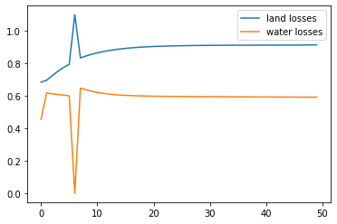
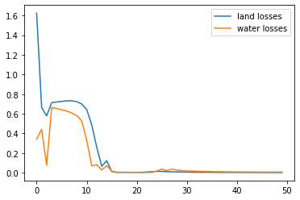

# Notes for 2phase notebook
Original losses for completely dense last layer with `num_classes * num_env` dim output

Next losses (batch size 4. Problem: samples are passed through the wrong classifier sometimes

Batch size 1 

